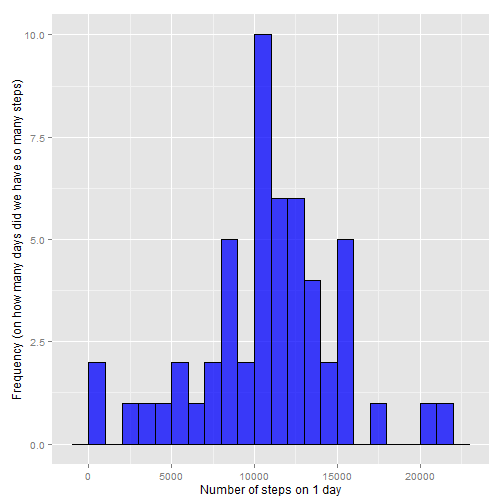
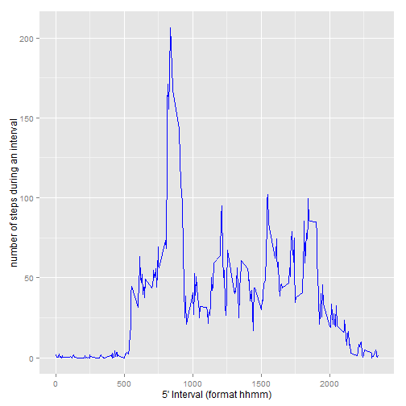
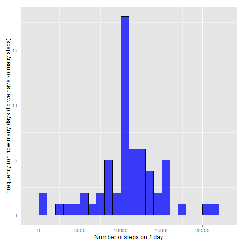
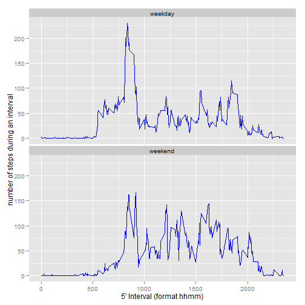

Reproducible Research: Peer Assessment 1
========================================
author : [@StefMT2970 ](https://github.com/stefMT2970)  

[Github repository] (https://github.com/stefMT2970/RepData_PeerAssessment1)  
  
Ref : R Core Team (2014). R: A language and environment for statistical
  computing. R Foundation for Statistical Computing, Vienna,
  Austria. URL http://www.R-project.org/.

## Loading and preprocessing the data
The dataset is contained in a zip file as part of this github repository.(modify the working directory)  
The date variable is read as a character string and then converted into Date. The interval is shown as HH:MM in a newly added field.


```r
setwd("d:/dev/app/gitrepo/RepData_PeerAssessment1")
```


```r
if(!file.exists("activity.csv")) unzip(zipfile="activity.zip")
act <- read.csv("activity.csv", stringsAsFactors=FALSE)
act$date <- as.Date(act$date, "%Y-%m-%d")
act$timeInterval <- paste(trunc(act$interval/100),
                          act$interval%%100,
                          sep = ":")
```
  
Some summary information about the dataset.


```r
summary(act)
```

```
##      steps             date               interval      timeInterval      
##  Min.   :  0.00   Min.   :2012-10-01   Min.   :   0.0   Length:17568      
##  1st Qu.:  0.00   1st Qu.:2012-10-16   1st Qu.: 588.8   Class :character  
##  Median :  0.00   Median :2012-10-31   Median :1177.5   Mode  :character  
##  Mean   : 37.38   Mean   :2012-10-31   Mean   :1177.5                     
##  3rd Qu.: 12.00   3rd Qu.:2012-11-15   3rd Qu.:1766.2                     
##  Max.   :806.00   Max.   :2012-11-30   Max.   :2355.0                     
##  NA's   :2304
```

```r
str(act)
```

```
## 'data.frame':	17568 obs. of  4 variables:
##  $ steps       : int  NA NA NA NA NA NA NA NA NA NA ...
##  $ date        : Date, format: "2012-10-01" "2012-10-01" ...
##  $ interval    : int  0 5 10 15 20 25 30 35 40 45 ...
##  $ timeInterval: chr  "0:0" "0:5" "0:10" "0:15" ...
```


## What is mean total number of steps taken per day?
We ignore missing values (NA).
Next we summarise total number of steps per day and we plot a histogram showing the frequency of total number of steps. From this we see that 10.000 to 12.000 steps per day occurs most often.

```r
library(ggplot2)
library(dplyr)
```

```
## 
## Attaching package: 'dplyr'
## 
## The following object is masked from 'package:stats':
## 
##     filter
## 
## The following objects are masked from 'package:base':
## 
##     intersect, setdiff, setequal, union
```

```r
actNoNA <- na.omit(act)
mtn <- actNoNA %>%
       select(steps,date) %>%
       group_by(date) %>%
       summarise_each(funs = "sum")
ghp <- ggplot(mtn, aes(steps))
ghp2 <- ghp +
   geom_histogram(binwidth = 1000,
                  colour="black", 
                  fill="blue", 
                  alpha=0.75) + 
   labs(x = "Number of steps on 1 day", 
        y = "Frequency (on how many days did we have so many steps)")
ghp2
```

 

From this, it is straighforward to calculate the mean and median of the 'total number of steps per day'.

```r
mean(mtn$steps)
```

```
## [1] 10766.19
```

```r
median(mtn$steps)
```

```
## [1] 10765
```


## What is the average daily activity pattern?
This time we will calculate the average number of steps per interval across all dates, still based on the dataset after ommitting NA values.
The plot shows a clear peak interval in the morning during which most steps occur. The which.max instruction gives the exact value for this peak. The interval is coded as hhmm (last2 characters are the minutes, preceded by the hours)


```r
adap <-  actNoNA %>%
         select(steps, interval) %>%
         group_by(interval) %>%
         summarise_each(funs = "mean")

glp <- ggplot(adap, aes(interval, steps))
glp2 <- glp + geom_line(colour="blue")+ 
      labs(x = "5' Interval (format hhmm)", 
           y = "number of steps during an interval")
glp2
```

 

```r
adap[which.max(adap$steps),]
```

```
## Source: local data frame [1 x 2]
## 
##   interval    steps
## 1      835 206.1698
```


## Imputing missing values
In the analysis so far we have eliminated the missing values. It proves there are approximately 13% of the records with missing values.


```r
missing <- (table(is.na(act$steps)))
missing
```

```
## 
## FALSE  TRUE 
## 15264  2304
```

```r
prop.table(missing)
```

```
## 
##     FALSE      TRUE 
## 0.8688525 0.1311475
```

An easy approach to impute missing values, is to replace a specific missing steps value by the mean for that interval across the actNoNA dataset used above.


```r
actimp <- act
for (i in 1:nrow(actimp)){
   if(is.na(actimp$steps[i])){
      actimp$steps[i] <- 
         round(adap[adap$interval == actimp[i,]$interval, ]$steps)
   }
}

sum(is.na(actimp))
```

```
## [1] 0
```

Now, we recreate the first histogram (number of steps take each day), but this time using the imputed missing values dataset. Because we inserted extra steps, the numbers reported changed.


```r
mtnimp <- actimp %>%
       select(steps,date) %>%
       group_by(date) %>%
       summarise_each(funs = "sum")
ghpimp <- ggplot(mtnimp, aes(steps))
ghpimp2 <- ghpimp +
   geom_histogram(binwidth = 1000,
                  colour="black", 
                  fill="blue", 
                  alpha=0.75) + 
   labs(x = "Number of steps on 1 day", 
        y = "Frequency (on how many days did we have so many steps)")
ghpimp2
```

 

The mean total numers of step taken by day is now 1.0765639 &times; 10<sup>4</sup> and the median is 1.0762 &times; 10<sup>4</sup> . There is no signficant difference in these 2 numbers when comparing the data set with missing values removed compared to the data set with imputed missing values. This should not be a surprise considering we took the mean of an interval as a strategy to replace the missing values.


## Are there differences in activity patterns between weekdays and weekends?

The dataset is enhanced with a factor variable to identify weekend versus weekday.


```r
library(timeDate)
dayType<- function(date){
   ifelse(isWeekday(date),"weekday", "weekend")
}

actimp$typeOfDay <- sapply(actimp$date, FUN=dayType)
actimp$typeOfDay <- as.factor(x=actimp$typeOfDay)
```

In the next panel plot we compare number of steps during intervals between weekdays and weekends. The graph shows that the explicit morning peak is a weekday phenomenon.


```r
adapimp <-  actimp %>%
         select(steps, interval, typeOfDay) %>%
         group_by(typeOfDay, interval) %>%
         summarise_each(funs = "mean")

glpimp <- ggplot(adapimp, aes(interval, steps))
glpimp2 <- glpimp + geom_line(colour="blue")+ 
      facet_wrap(~typeOfDay, nrow=2) +
      labs(x = "5' Interval (format hhmm)", 
           y = "number of steps during an interval")
glpimp2
```

 

